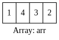

> [Prepare](https://www.hackerrank.com/dashboard) > [Data Structures](https://www.hackerrank.com/domains/data-structures) > 
[Arrays](https://www.hackerrank.com/domains/data-structures/arrays) > [Arrays - DS](https://www.hackerrank.com/challenges/arrays-ds/problem)
# Arrays - DS

### Problem
An array is a type of data structure that stores elements of the same type in a contiguous block of memory. 
In an array, _**A**_, of size _**N**_, each memory location has some unique index, **i** (where _**0 &le; i &lt; N**_), 
that can be referenced as _**A[i]**_ or _**A<sub>i</sub>**_.

Reverse an array of integers.<br/>
**Note**: If you've already solved our C++ domain's Arrays Introduction challenge, you may want to skip this.

#### Example
**_A_ = [1, 2, 3]** <br/>
Return **[3, 2, 1]**.

#### Function Description
Complete the function `reverseArray` in the editor below.

`reverseArray` has the following parameter(s):
- `int` **A[n]**: the array to reverse

#### Returns
- `int[n]`: the reversed array

#### Input Format
The first line contains an integer, **N**, the number of integers in **A**.<br/>
The second line contains **N** space-separated integers that make up **A**.

#### Constraints
- $1 \leq N \leq 10^3$
- $1 \leq A[i] \leq 10^4$, where **A[i]** is **i<sup>th</sup>** integer in **A**

#### Sample Input


```
4
1 4 3 2
```

#### Sample Output
```
2 3 4 1
```
